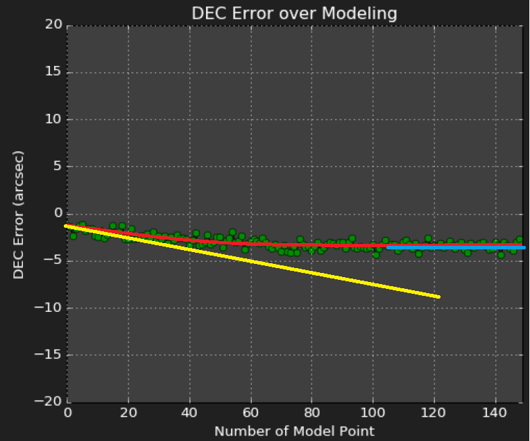

## How time flexure could be discovered

Using dec error diagram from analyse window:

The points are green (so mount was located on east side of pier). I did 150 points each 20 seconds. What you see is that dec
error increases over time from about 1,5 arcsec at the beginning to about 4 arcsec at the end (blue line) after about 90 x 20
seconds equals 30 minutes. It seems to be an e-function (red line) with an reasonable gradient at the beginning (yellow line).
As result I would say that I had to wait half an hour longer for cool down in future before doing model and starting imaging.

But that's just an example I had and it may vary depending of you setup!

[Back to analyse data](analysedata.md)

[Back to first steps](firststeps5.md)

[Back Home](home.md)