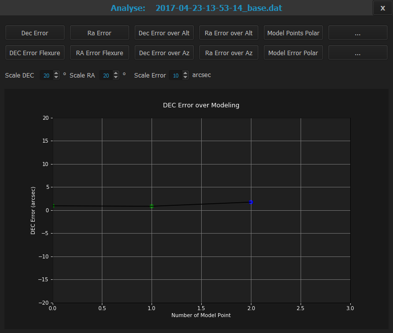
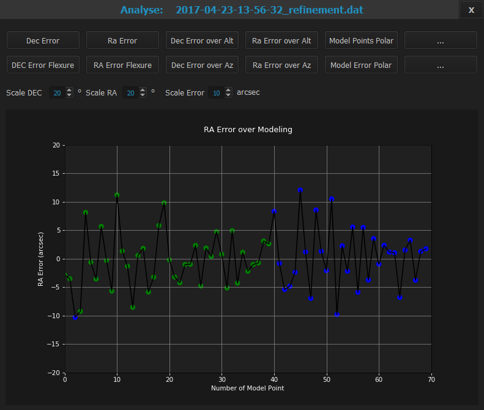
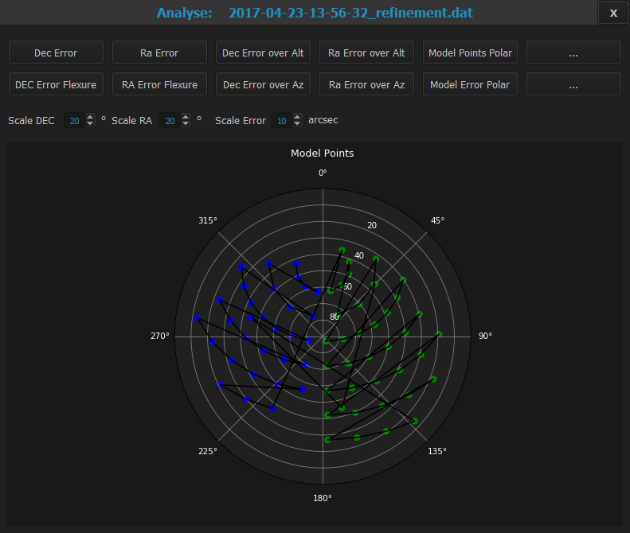

## Which data is stored in analysedata folder ?

Please have a look into your working directory and open the
<pre> /analysedata </pre>
subfolder (green circle).

I put an example of my test environment down. I did two times a modeling run. All files from modeling runs will have a coding
<pre>YYYY-MM-DD-HH-MM-SS_"extension".dat</pre>
with some extensions. The date and time is the beginning time of the runs.

So you see two sets of two files named with an extension _base and  _refinement (red box 1). In that files the data from the
model run is stored.

In addition you see a set of named files (blue box 2), where the synced model data from [Manage Mount Models](firststeps4.md)
are stored.

Lets have a look to this data with analyse functions:

First the base model. You only see three points, I chose the DEC axis:

Next to the refinement model with much more points, again the DEC axis:

And the refinement model with the RA axis:

In both charts you see that the model is made with model points on each pierside after another. You also see the deviations
of the error. The error were equally distributed, so my guess would be, that there is no big issue in the setup, which could
 be seen.

The last two diagrams are the model points polar:

where you can see the result of an pointcloud distribution of the model points. You can see "rings" , the greater circles,
around the altitude point where my site location is (about 48 degree north).

and last but not least the model error for these model points:

Still you can see areas, where the error is bigger than others.

[Back to analyse data](analysedata.md)

[Back to first steps](firststeps5.md)

[Back Home](home.md)