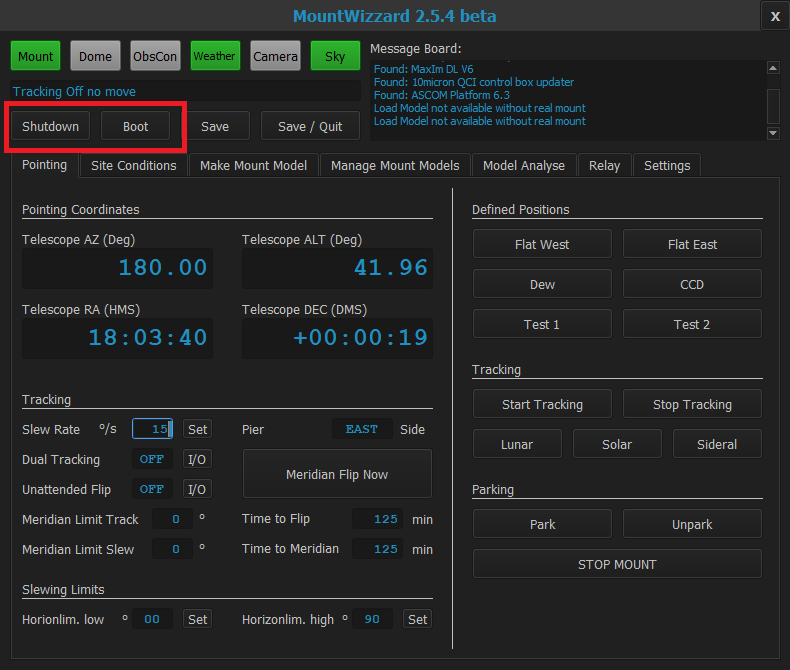

## First steps in MountWizzard

### Booting and shutdown of mount

If you have configured the IP and MAC address of your mount, because you have a direct ethernet
connection established, you could boot your mount from firmware 2.15.7 on with Wake On Lan (WOL)
feature by pressing the boot button.

The shutdown command to the mount could be send with the shutdown button.

[Back Home](home.md)