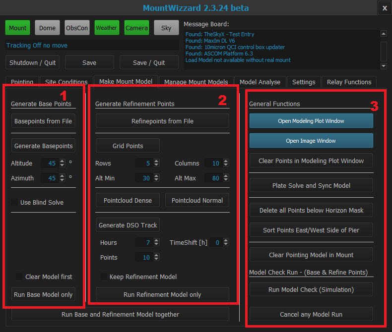

## Make Mount Model TAB

### Area 1 - Base Model
The first ares show all functions, which are necessary for building a base model. If you have already generated a set of
model points with Per's modelmaker and you have configured this file under [settings - area 3 - model points file](settings1.md)
you just could use them by "Show Base Points".
Alternatively you could generate new base points based on a simple rule: MountWizzard distributes the point equally over the 360
degree azimuth range starting from the given azimuth value at the given altitude.

In case of having only a raw setup rig, there might be a good chance, that the plate solver doesn't find a solution in your FOV,
because you are too far off. If the [configured imaging application](settings1.md) supports blind solving (like SGPro) and you have configured
blind solving in this application, you can choose blind solving for the first three base points. Blind solving takes far more time
than normal plate solving, please make you choice.

There is a checkbox for "clear model first". When checked, MountWizzard will delete you actual model and data in the mount before
adding new base points. In most cases it makes a lot of sense having that option set to on, because you need a clean start for modeling.

<b>"run base model only"</b> will start the model building. The button will be blue during the model run. You cannot start multiple
runs at the same time. If you would like to stop manually, please select "cancel any model run".

### Area 2 - Refinement Model

Generally MountWizzard keeps base and refinement model separated. This is not forseen in the firmware of the 10micron mount. The mount treats
the first 3 points as the base points and all following points refine the model. Basically you have some iterations with the base points
to setup you rig etc. After that your finished with base and doing refinement. If you are fine with this, you're set. If you would like to
tweak a little bit, you don't want to start with base all the time. Therefore MontWizzard stores the last base model. Whenever you start a
refinement session, this base model (if there is one) will be loaded and refinement starts from this point. So you could do many refinements
based on one set.

Area 2 shows the functions for refining the model. Like in the base model you have the possibility of using the an existing set of
model points from Per's Modelmaker (configured this file under [settings - area 3 - model points file](settings1.md)) just by pressing
"Show Refine Points". In Per's files base and refine points are stored in the same file.

<b>"Grid points"</b> enables you to generate a grid of points equally distributed over the full azimuth and the given altitude (min/max) range.
You can choose the number of point for rows and columns separately. Please take into account: the higher the altitude is, the closer the
points will be in the real hemisphere. The azimuth/altitude diagram is in that sense misleading about the density of the points.

<b>"Pointcloud"</b>: To avoid this problem, MountWizzard offers a function of generating point along greater circles in the hemisphere, which have equal
distances. The plotting in azimuth / altitude diagram might be a little wired, but if you see them in a polar diagram, you will recognise
the goal. The calculation is done based on you site data. There are two options "pointcloud dense" and "pointcloud normal" which do the
same job, but have different numbers of stars involved (more in dense, less in normal). Dense should giv you the chance to reach 100 points
plus, where normal should lead in the direction 50-70 points. This depends how you have set you horizon mask.

<b>"Generate DSO Track"</b> is an expert feature for further refinement od you model. the idea behind this function is, that you are telling
MountWizzard, which object you would like to image (this is done by slewing th mount the that object) and than generating model points
along the track this object will have during you imaging session. So you model along you target track and not randomly. For practical
reasons it might be a good idea to at least a little bit more than just a base model. As explained, MountWizzard clears refinement model part
before starting refinement process. In the special case of DSO Track this might be not desired. Therefore you can keep an existing refinement model
by setting the checkbox "keep refinement model.

<b>"run refinement model only"</b> will start the model building. The button will be blue during the model run. You cannot start multiple
runs at the same time. If you would like to stop manually, please select "cancel any model run".

### Area 3 - General Functions

<b>"open modeling plot window"</b> will open the [modeling plot window](modelingplotwindow.md), where all informations about modeling points,
the modeling process, progress in building, logs etc. are shown. MountWizzard stores the information, if you have opened this windows
and with the next start of MountWizzard it will be opened automatically at the same location.

<b>"open image window"</b> will open the [image window](imagewindow.md), where you see the actual take image during model build.

<b>"clear modeling plot window"</b> will clear all modeling point in this window.

<b>"plate solve and sync model"</b> take an image from the actual position the mount has, plate solves it and syncs the mount model
to this reference. So no new model is made, but the actual one in synced to the solved pointing. This could be used, if you have a
permanent pier with mount installed and you have some small deviations.

<b>"delete all points below horizon"</b> is an important feature to manage the modeling points. If you have [area 3 - setup a horizon mask](settings1.md),
which is BTW recommended, you can delete all the points, which a below the given horizon mask.

<b>"sort east / west"</b> will sort you modeling points in an order to have the pier sides east / west in cluster order. So all points
on the east side will be modeled first, than pier flip and than all on the west side will be processed. This avoids many pier flips
during the modeling session and saves you time.

<b>"clear model"</b> will clear the existing model in the mount manually.

<b>"cancel any model run"</b> will stop a base / refinement / model check / combined model run next possible time. The button is red
until the cancel is succeeded.

<b>"run base and refinement model together"</b> will start the model building for first base and than refinement after another. The button will be blue during the model run. You cannot start multiple
runs at the same time. If you would like to stop manually, please select "cancel any model run".

If you only need modeling that's all you need to know.

[Back to first steps](firststeps.md)

[Back to Home](home.md)