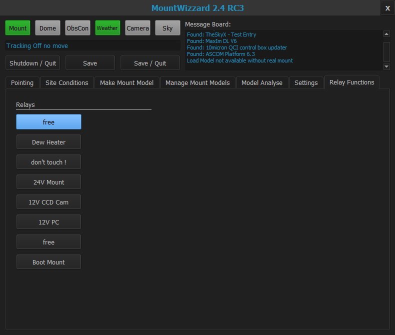

## Relay functions

On the relay functions tab you could use the configured functions of each of the 8 relays of th KMTronic relays board.

[Back to first steps](firststeps.md)

[Back to Home](home.md)