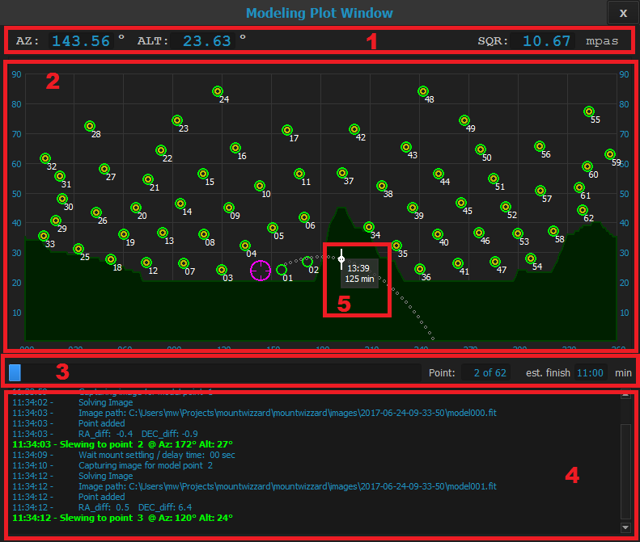

## The modeling plot window

### Area 1 - Status information about pointing and sky quality

### Area 2 - Azimuth / Altitude diagram

### Area 3 - Model building progress

### Area 4 - Model building logging

### Area 5 - Tracking widget

[Back to first steps](firststeps.md)

[Back to Home](home.md)