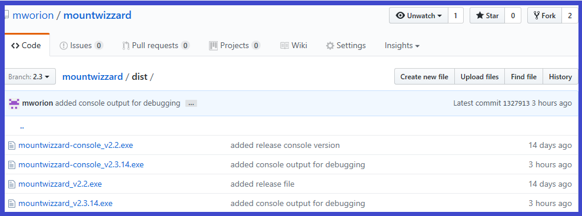
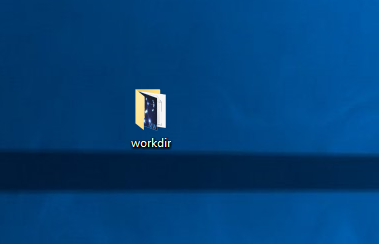
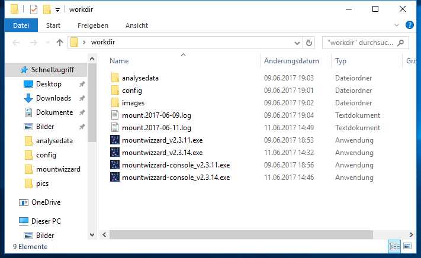

## Installation of MountWizzard

Please read the following parts to be sure to make the right steps for the successful installation of
MountWizzard. If you have problems, the right spot where to post messages is the 10micron software
developer forum on: http://www.10micron.eu/forum/viewforum.php?f=18. Please take into account that I'm
doing the software as a hobby and you can't expect the support you will have on paid software :-)

### Where to find the Application ?

The application as well as this documentation and the distribution itself is hosted on github:

https://github.com/mworion/mountwizzard3-dist.

You will find the readme in the main page, which also directs to the extended documentation. The
interesting part for downloading the application is the subdirectory /dist in github. The page is
looking like the following example and the /dist folder is marked red:

If you choose the /dist folder, you could see the application files for download:

You will normally see 4 application files: there are the released ones (in the example above version v3.0)
and the latest beta version. Please remember that even version numbers (like 2.2.x) are release versions
and uneven numbers (like 2.3.x) are beta ones. For betas in general: please provide detailed feedback
including tests so that it enables others to participate in improving MountWizzard as well.

There are basically two versions of each release: a version which is called mountwizzard_vx.y.z and a
second version called mountwizzard-console_vx.y.z. Both of them share the same functionality. The only
difference is that the console version show in addition to the MountWizzard windows a command window,
where the pyinstaller bootloader writes his output to. So in case you have troubles starting MountWizzard,
please start the console version and save the output of the command window for further investigations.

So the best way is to download both versions (pure and console) to you computer.

#### Reminder: As I am currently not able to offer signed applications, please ensure virus checking on your side for your own safety!
Before I put the application to github they are OK, but you never know.

### Compatibility
Actually the application package (.EXE) is tested and verified to be able to run in win7 and win10
operating systems. Both 32bit and 64bit are supported. The bundle itself contains only 32bit runtime
libraries. Older versions like vista have not been tested successful.
The package file (.tar.gz) is tested in ubuntu 16.04 LTS and Mac OSx high sierra. On these systems
python 3.6.5 has to be installed manually.

### Preparation on your computer
#### ASCOM framework
MountWizzard runs on windows with ASCOM 6.2 and 6.3.  If you didn't already install the ASCOM Framework
on you windows computer for astronomy use, you can do it now. You will find the download at:
http://ascom-standards.org.

#### INDI framework
On other platforms (but on windows as well you might use the INDI framework (http://indilib.org).
There is no need for doing any install as long as you have an INDI server in your setup already running.
You should know it's IP address. That's all.

#### Simulation mode
There is the question is there any simulation mode for your software. The answere is yes. There is a
limited simulation mode running if you are using the INDI framework and having an INDI server setup
with CCD Simulator, TelescopeSimulator running. This setup could be used without mount connection to test
imaging. If you would like to test modeling, you need a real moutn connection and the mount will actually
move !!!

#### Astrometry.Net plate solving
As in windows environment you might use the plate solver of your favorite imaging program through
MountWizzard, this could not be done if ou are on INDI only. MountWizzard uses the Astrometry.net service
instead. The service could be installed locally or you are using the online version at
http://nova.astrometry.net. In the latter case, please register and get your personal API key. Please
remind that you need for the online solver an internet connection and it's definitly slower than any local
plate solving program.

#### Local Astrometry.net installation
I really recommend using this software. It works great (and it is free of charge, too)

There is a great project done by Jussi who enables the use of astrometry on your local harddisk without
internet connection. We both tested MountWizzard3 to work with astrometry-api-lit together and I would
recommend this solution. You will find all necessary information on
<pre>https://github.com/Jusas/astrometry-api-lite</pre>
Astrometry-api-lite is available for linux and Windows10.
Some hints if you are using astrometry-api-lite: If you don't need extended features, you could set the
options
<pre>
storeObjsImages: false
storeNgcImages: false</pre>
They are located under the <installation directory>/dist/worker in the file configuration.json. This will
at least double the solving speed.

#### Preparing local working directory
If you would like to use MountWizzard on you astro imaging computer, it makes a lot of sense to create a
working directory of your choice and location on your computer. Please keep in mind, that you need write
permissions in that directory, otherwise MounWizzard won't run and work.
So for simple demo, I put it on the desktop:

Please put the downloaded application and start it. MountWizzard will create in that directory some
subdirs:

<pre> /config </pre>

where all the configuration like the config from MountWizzard, also your horizon file and your model
points file (if you have one from ModelMaker for example) and some downloaded mount computer updating
data (comets, asteroids, UTC files etc.). In addition you will find your stored profiles as well in this
directory.

<pre> /analysedata </pre>
where all files are stored, which were created with every model building run. This includes the data
for model making out of data. And finally

<pre> /images </pre>

where all the images were stored, if you would like to keep the images you made during model build.

After some days the folder might look like that:

In addition you find log files after the first and any following run of MountWizzard calling mount.YYYY-MM-DD.log. In these files MountWizzard
stores all the debug and logging information, which might be used for trouble shooting. Please keep these files at least some days and post them
if you would like to raise some questions. the log files could become large, so take care about the sizes.

[Back to Home](home.md)