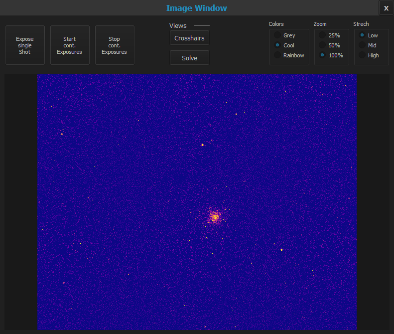

## Overview
### Main Screen

MountWizzard opens of a set of windows depending on the use case you would like to follow. The main windows opens when started,
the other windows could be opened when haven the right use case. E.g. Modeling Plot Window could be opened from
["Make Mount Model"](firststeps3.md) Menue, the Analyse Window could be opened from ["Model Analyse"](firststeps5.md). MountWizzard
saves the status of the windows. So once opened, after the next start windows will automatically opened accordingly. MountWizzard
stores the positions of the windows as well.

There is one topic to take care of: the gui can't react on different DPI resolution settings in windows environment. Please keep them
to 100% as default, otherwise length of texts etc. might not fit in the surrounding boxes. Sorry for that, but it's a bunch of work
to make this happen, and there is roughly any strong request for it.

First, there is the main screen:

### Modeling Plot Window
Mountwizzard can show th so called "Modeling Plot Window" where you can follow and manage in detail the modeling process:

### Analyse Window
After modeling you can do some analytics of your model runs. This is mainly located in the "Analyse" window:

### Image Window
If you opened the image windows, all images taken through MountWizzard will be show. You can take as well a single shot of your
own. Single shots are disabled during model building.

[Back to Home](home.md)