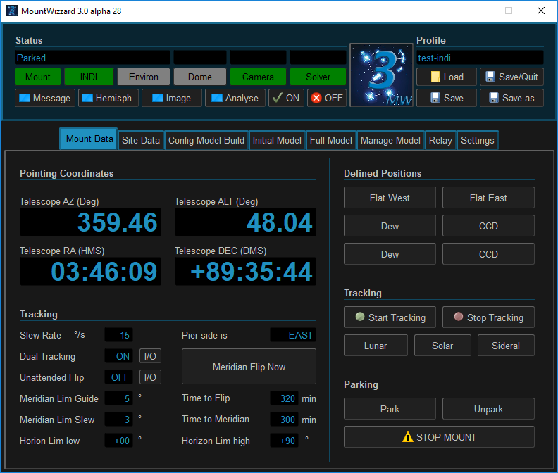
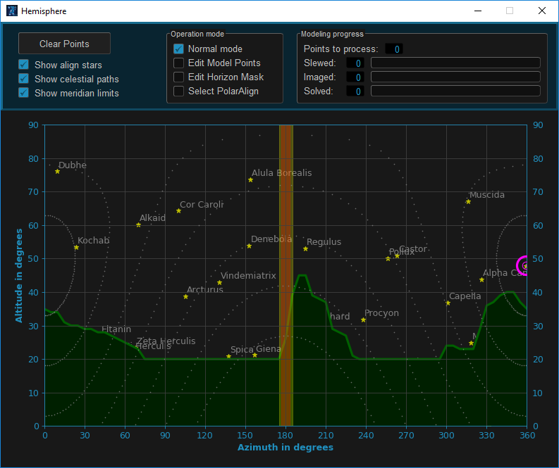
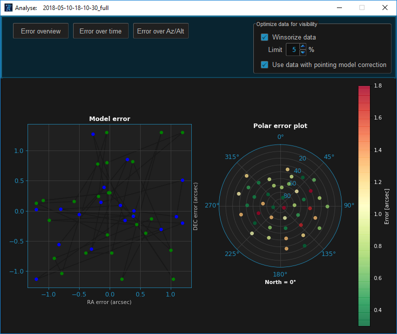
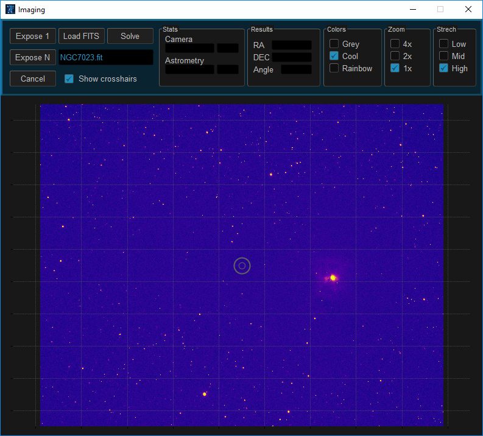

## Overview
### Main Screen

MountWizzard opens of a set of windows depending on the use case you would like to follow. The main windows
opens when started, the other windows could be opened at any time. MountWizzard saves the status and positions
of the windows. So once opened, after the next start windows will automatically opened accordingly.

There is one topic to take care of: the gui can't react on different DPI resolution settings in windows
environment. Please keep them to 100% as default, otherwise length of texts etc. might not fit in the
surrounding boxes. Sorry for that, but it's a bunch of work to make this happen, and there is roughly any
strong request for it. First, there is the main screen:

### Hemisphere Window
This is the center of defining and watching your setup of model making. You see a hemisphere, where your horizon
mask is shown , the model points are plotted, where you could see model making progress and you can edit model
points and the horizon mask as well.

### Analyse Window
After modeling you can do some analytics of your model runs. This is mainly located in the "Analyse" window:

### Image Window
If you opened the image windows, all images taken through MountWizzard will be shown. You can take as well a
single shot of your own or plate solve an image if present. Single shots are disabled during model building.

[Back to Home](home.md)