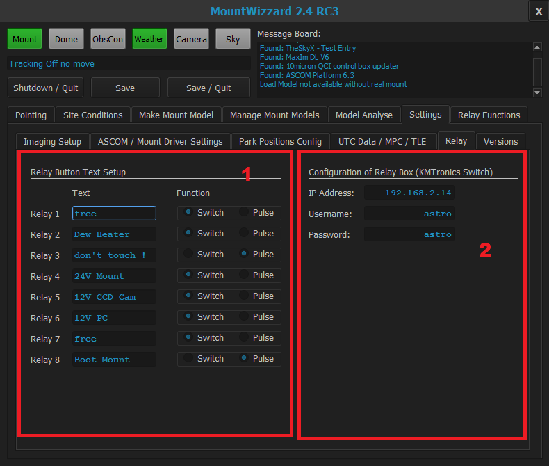

## Status for versions information

### Area 1: Configuring the relay functions and text buttons

Mountwizzard allows you to configure the function for the relay board. First the text entries set the text on the buttons
under the "Relay Functions" menu. Second you could choose if the relay function is switch, which basically toggles the
state of the relay (on / off) or you choose Pulse, which switches the relay for 1 second to "on" and afterwards to "off".
The Pulse config could be used for the boot function of the mount.

### Area 2: Configuring the KM switch

The KM Relay board has to be configured with IP address, username and password for accessing it via ethernet.

[Back to settings](settings.md)

[Back to first steps](firststeps.md)

[Back to Home](home.md)