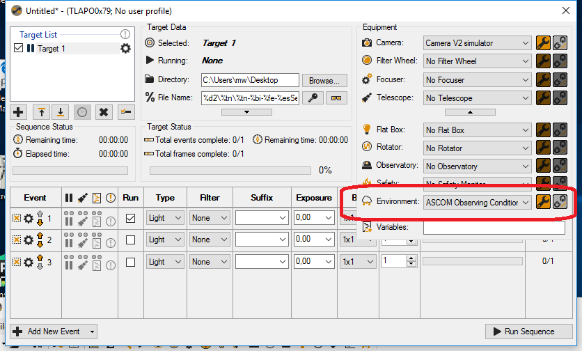
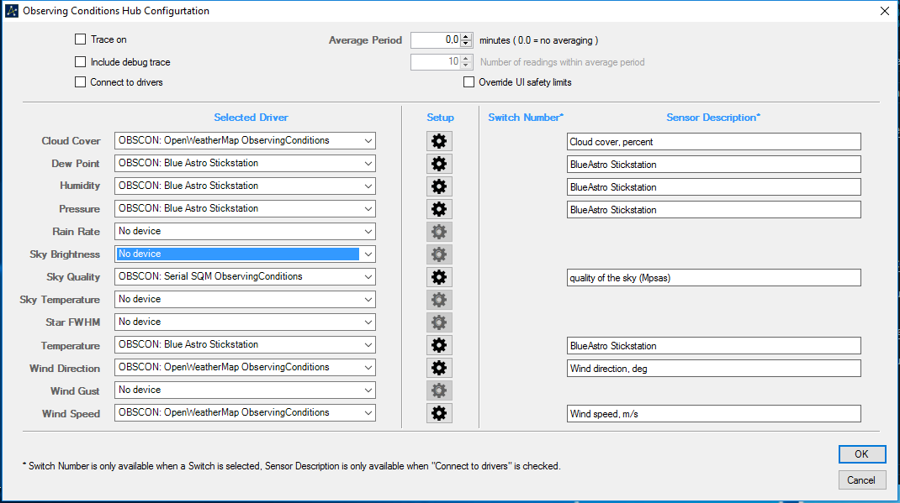

## ASCOM Environment Conditions Hub Config

I'm using SGPro as my imaging setup. To make the best out of it, I choose the ASCOM Observation Conditions Hub as my environment device:

if you configure that hub with data from open waether, stickstation (or MBox) and unihedron driver, SGPro puts all this data in you FITS
image files. With that information you can later check the conditions of you night ! Here my setup in the ASCOM hub:

[Back to settings](settings.md)

[Back to first steps](firststeps.md)

[Back to Home](home.md)