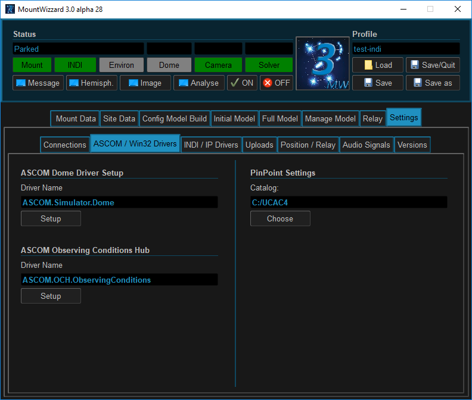

## Settings for ASCOM / Mount Drivers environment drivers

### Area 1: PinPoint
If yo have full (!) version of PinPoint installed, you could use this directly for plate solving.
Only point you have to define is the location of the catalog. Please use the standard names of the
directories that MountWizzard3 could determine the type for PinPoint. Supported catalogs are:
- UCAC4
- GSC
- UCAC3
- USNO

### Area 2: Setup Ascom Devices
Beside camera and telescope you could have several devices connected. MountWizzard supports some types:

#### ASCOM Domes (Azimuth only)
The support of Dome is limited to slew a connected Dome to the right azimuth before moving on doing the
next image. It's not a fully supported Dome remote.

#### ASCOM Observing Conditions Hub
- Observing Conditions(ObsCond) at the mount: Stickstation or MBox
- Observing Conditions on Open Weather
- Observing conditions for SQR metering: Unihedron SQR Device

The ObsCond is the important device, where MountWizzard takes the information for update the refraction
parameters. Normally you would use a Stickstation or a MBox solution. But basically all devices, which
deliver that data (temperature, humidity, pressure, dew point) could be used. If you don't own one of
them, you still can use Open Weather.

The Open Weather service gives you more information. You have to obtain an API key. Please check their
website http://openweathermap.org/api for further informations.

Last, but not least, you can have a sky quality meter from Unihedron attached. You have to use a USB
type and you have to connect it via ASCOM. There is a driver written by animaal
(SGPro Forum under http://forum.mainsequencesoftware.com/t/environment-device-values/5051/16)
you find the driver on http://www.dizzy.eu/downloads.html. It does a great job!

[Back to configuration](configuration.md)

[Back to Home](home.md)