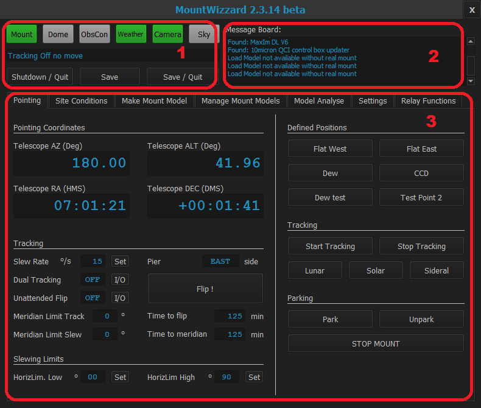

## First start of MountWizzard

### Overview of working areas inside MountWizzard main screen

Basically you have 3 main areas, where the functions of MW are located:

### Area 1

You have the status buttons of the devices showing different colors:

- grey: device not configured or disabled
- red: device configured, but not connected
- yellow: device connected, but not fully functional
- green: device connected and full function

The yellow color only exists in camera device. There you could distinguish between the application fpr imaging is running
(showing yellow) and the camera itself is connected to the imaging application itself (green).

### Area 2

It's called the message board. So all necessary information, status hints or error messages are displayed there. It's like
a log for MountWizzard. Please notice that the log for the model building is show in a board ion the model plot window. The
message board is scrolling. So if you missed a message please scroll up to view it again.

### Area 3

Basically this is the functional area, where most of the user interaction of MountWizzard takes place. The functions are
ordered in TABs:

- [Pointing TAB](11start01)
- [Site Conditions TAB](11start02)
- [Make Mount Model TAB](11start03)
- [Manage Mount Models TAB](11start04)
- [Model Analyse TAB](11start05)
- [Sittings TAB](11start06)
- [Relay Functions TAB](11start07)

[Home](00home.md)