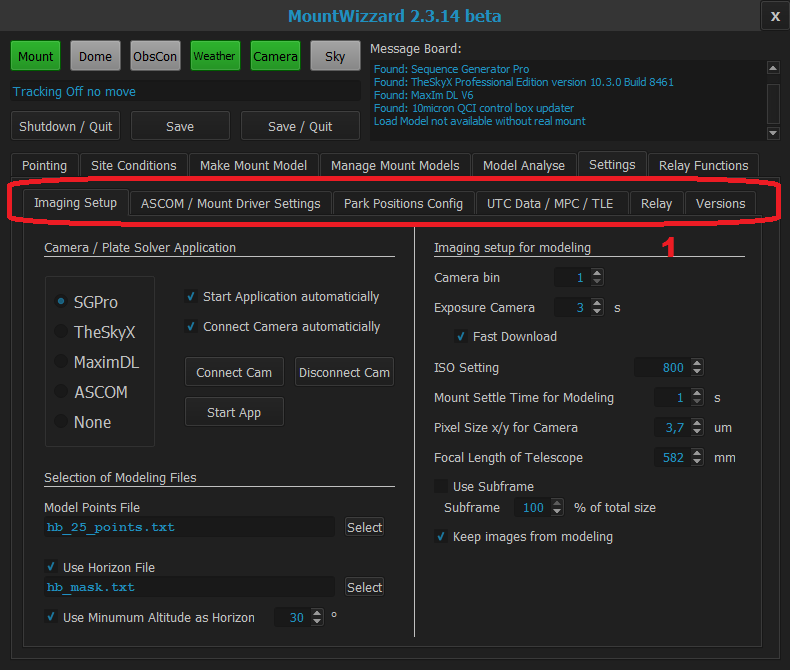

## Settings TAB

### Area 1

Area 1 shows a second level ob TAB for doing all configuration settings. These are in the following:

- [Imaging Setup TAB](11start061.md)
- [ASCOM 7 Mount Driver Settings TAB](11start062.md)
- [Park Position Config TAB](11start063.md)
- [UTC Data / MPC / TLE TAB](11start064.md)
- [Versions TAB](11start065.md)

[Screens](11start00.md)

[Home](00home.md)