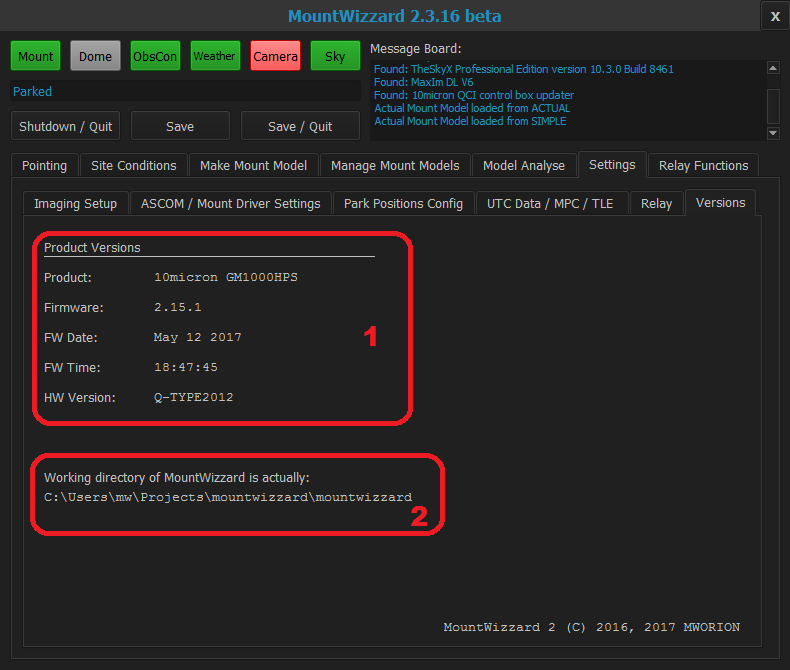

## Version TAB

### Area 1: Version

Mountwizzard checks for all information once at startup. It will show product and version data.

### Area 2: Working directory

Just as a reminder for knowing where you are currently working: Here is the actual used working directory shown.

[Back to Settings TAB](11start06.md)

[Back to first steps](11start00.md)

[Back to Home](00home.md)