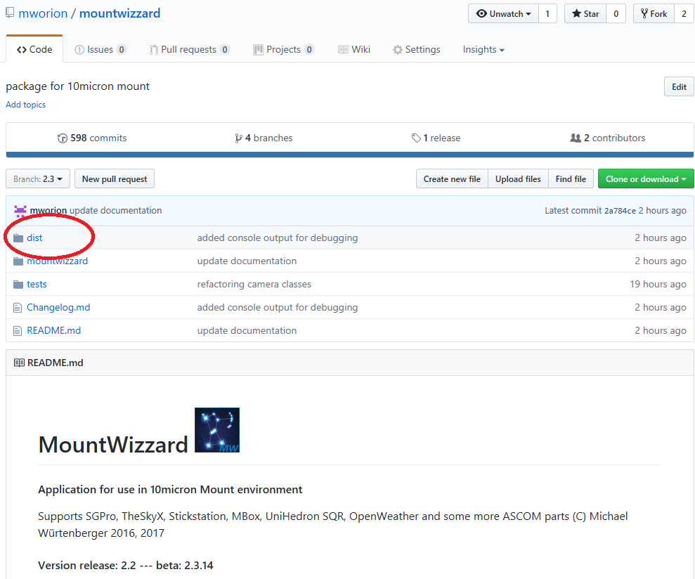
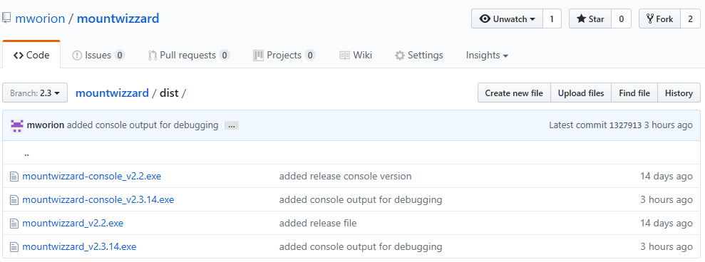

## Installation of MountWizzard

Please read the following parts to be sure to make the right steps for the successful installation of MountWizzard. If you
have problems, the right spot where to post messages is the 10micron software developer forum on: http://www.10micron.eu/forum/viewforum.php?f=18.
Please take into account that I'm doing the software as a hobby and you can't expect the support you will have on paid software :-)

### Where to find the Application ?

The application as well as this documentation and the software code itself is hosted on github: https://github.com/mworion/mountwizzard.
You will find the readme in the main page, which also directs to the extended documentation. The interesting part for downloading the
application is the subdirectory /dist in github. The page is looking like the following example and the /dist folder is marked red:

   

   

If you choose the /dist folder, you could see the application files for download:

   

   

You will normally see 4 application files: there are the released ones (in the example above version v2.2) and the latest beta version
(in the example v2.3.4). Please remember that even version numbers (like 2.2.x) are release versions and uneven numbers (like 2.3.x)
are beta ones. For betas in general: please feedback your experience that all users could participate in improvements ans test you made.

There are basically two versions of each release: a version which is called mountwizzard_vx.y.z and a second version called
mountwizzard-console_vx.y.z. Both of them share the same functionality. The only difference is that the console version show in addition
to the MountWizzard windows a command window, where the pyinstaller bootloader writes his output to. So in case you have troubles
starting MountWizzard, please start the console version and save the output of the command window for further investigations.

So the best way is to download both versions (pure and console) to you computer.
#### Reminder: As I am currently not able to offer signed applications, please ensure virus checking on your side for your own safety!
Before I put the application to github they are OK, but you never know.

### Compatibility
Actually the application package ist tested and verified to be able to run in win7 and win10 operating systems. Both 32bit and 64bit are
supported. The bundle itself contains only 32bit runtime libraries. Older versions like vista have not been tested successful.

### Preparation on your computer
#### ASCOM framework
MountWizzard runs with ASCOM 6.2 and 6.3. You have to install ASCOM Framework in advance to be able to run MountWizzard. If you didn't
already install the ASCOM Framework on you computer for astronomy use, please do so now. You will find the download at: http://ascom-standards.org
If you would like to test MountWizzard in simulation mode, please choose the .NET versions for telescope and dome simulator:
   

   
Some older stuff won't work properly. If you would like to use the ASCOM simulation for the camera as well, please use the camera V2 simulator
and keep the resolution of the camera simulator with 800x600 pixel (default). With that size, MountWizzard will recognize simulation mode for
the camera as well.

#### Preparing local working directory
If you would like to use MountWizzard on you astro imaging computer, it makes a lot of sense to create a working directory of your choice and
location on your computer. Please keep in mind, that you need write permissions in that directory, otherwise MounWizzard won't run and work.
So for simple demo, I put it on the desktop:
   

   
Please put the downloaded application and start it. MountWizzard will create in that directory some subdirs:

<pre> /config </pre>

where all the configuration like the config from MountWizzard, but also your horizon file and your model points file (if you have one from
ModelMaker for example) and some downloaded mount computer updating data (comets, asteroids, UTC files etc.)

<pre> /analyse </pre>
where all files are stored, which were created with every model building run. And finally

<pre> /images </pre>

where all the images were stored, if you would like to keep the images you made during model build.

After some days the folder might look like that:
   

   
In addition you find log files after the first and any following run of MountWizzard calling mount.YYYY-MM-DD.log. In these files MountWizzard
stores all the debug and logging information, which might be used for trouble shooting. Please keep these files at least some days and post them
if you would like to raise some questions. the log files could become large, so take care about the sizes.

### DSLR
Actually the SGPro API had some problems with DSLR Cam's. As I don't own a DSLR for imaging, there is
hardly any chance to test it in detail. With the current betas, there should be an improvement if not
finally fixes all issues.

### First start of MountWizzard

### What to do if ?

[Home](home.md)