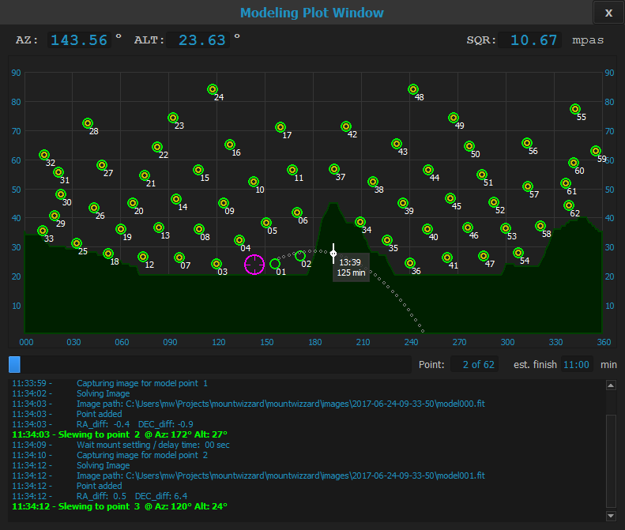

## First start - Overview
### Main Screen
Mountwizzard open of a set of windows depending on the use case you would like to follow. First, there is the main screen:

### Modeling Screen
Mountwizzard can show th so called "Modeling Plot Window" where you can follow and manage in detail the modeling process:

### Analyse screen
After modeling you can do some analytics of your model runs. This is mainly located in the "Analyse" window:

[Home](home.md)